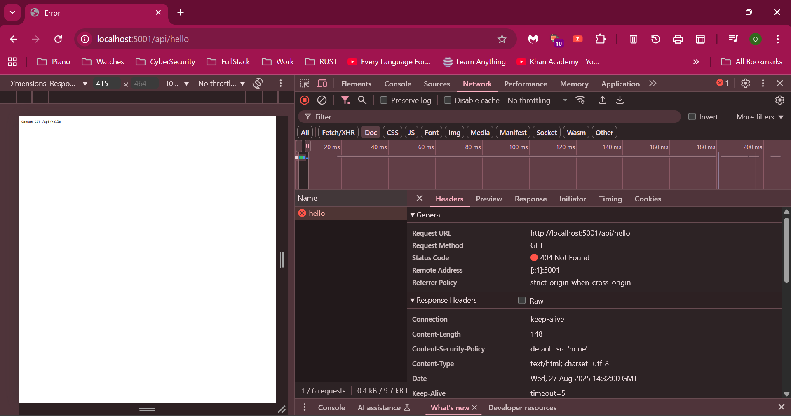

# Backend Notes

## Common Commands

| Command                      | Description                                                      |
|------------------------------|------------------------------------------------------------------|
| `npm init -y`                | Initializes a `package.json` file for scripts and dependencies.  |
| `npm i express@4.18.2`       | Installs Express (backend framework) and dependencies.           |
| `npm install nodemon -D`     | Installs Nodemon as a dev dependency for auto-reloading server.  |
| `node server.js`             | Runs the server (deprecated, use scripts instead).               |
| `npm run dev`                | Runs the server in development mode using Nodemon.               |

## Scripts in `package.json`

```json
"scripts": {
  "dev": "nodemon server.js",   // Development
  "start": "node server.js"     // Production
}
```

## How a Full-Stack App Works

| Step                | Flow                                   |
|---------------------|----------------------------------------|
| Client Request      | Client → Server                        |
| Server Response     | Server → Client (DOCS/Response)        |

## API (Application Programming Interface)

| Flow                | Description                            |
|---------------------|----------------------------------------|
| End-User → API      | Sends request to server                |
| Server → End-User   | Sends response back to client          |

## CRUD Operations via REST API

| HTTP Method | Operation      | Description                |
|-------------|---------------|----------------------------|
| POST        | Create         | Create a resource          |
| GET         | Read           | Retrieve a resource        |
| PUT         | Update         | Update a resource          |
| DELETE      | Delete         | Remove a resource          |
| OPTIONS     | Options        | Shows available methods    |

## HTTP Status Codes

| Code Range | Meaning         | Examples & Notes                                                                 |
|------------|----------------|----------------------------------------------------------------------------------|
| 1xx        | Informational   | -                                                                                |
| 2xx        | Success         | -                                                                                |
| 3xx        | Redirection     | E.g., 301 (Moved Permanently), HTTP→HTTPS                                        |
| 4xx        | Client Error    | 400 (Bad Request), 401 (Unauthorized), 403 (Forbidden), 404 (Not Found), 429 (Too Many Requests) |
| 5xx        | Server Error    | 500 (Internal Server Error), 503 (Service Unavailable)                           |


## Key Concepts

| Term         | Description                                                                 |
|--------------|-----------------------------------------------------------------------------|
| Endpoint     | Combination of URL + HTTP Method for interacting with a resource            |
| API Routes   | Defined in server.js, e.g., `app.use("/api/notes", notesRoutes);`           |
| Controllers  | Organize logic for API endpoints, making code easier to maintain and update |

---

*This document summarizes backend setup, API structure, and key concepts for a MERN stack project